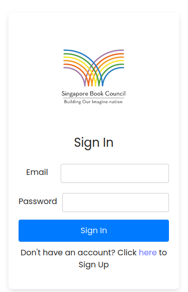
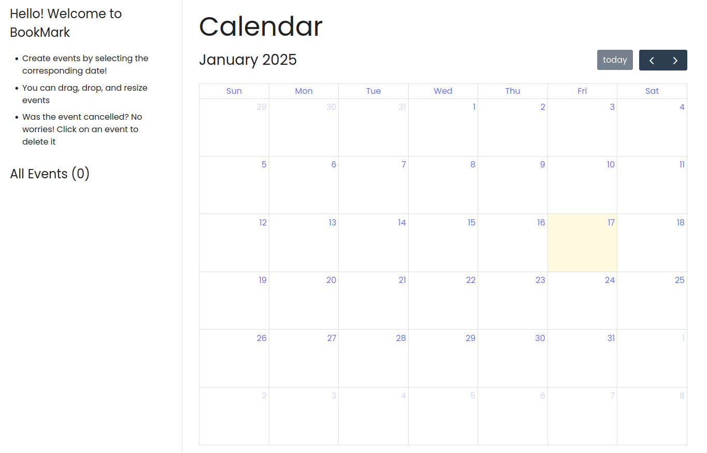
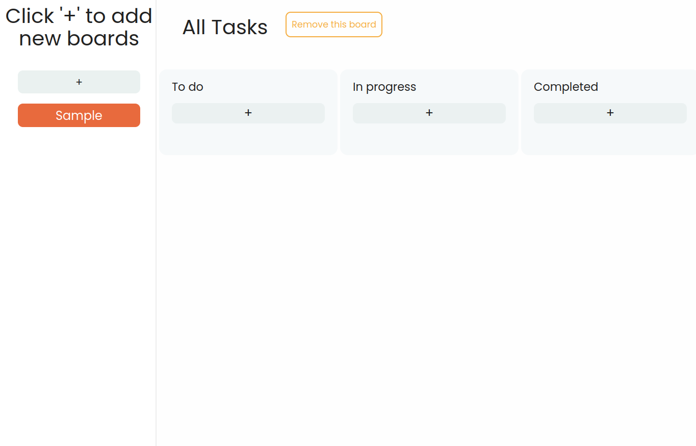

# BookMark

## Using the app

Step 1. Login
When opening the app for the first time you will be greeted to the login screen

**Login**

- Enter your email
- Enter your password
- Press sign in

**Sign Up Functionality**

- Click on "Click here to sign up"
- Enter Email and Password
- Click sign up
- The app will log up in automatically

## **Calendar View**

- Through the calendar view, users can look at upcoming deadlines and to-dos
- To add a todo
  - click on the date, add a description and click ok

## Task management

- We have integrated a kaban board in our frontend inorder to handle the task managment
- In order to add a task, click on the + icon.
- After the task has been added it can be moved to the tab with "In Progress" or "Completed" to signify its status
